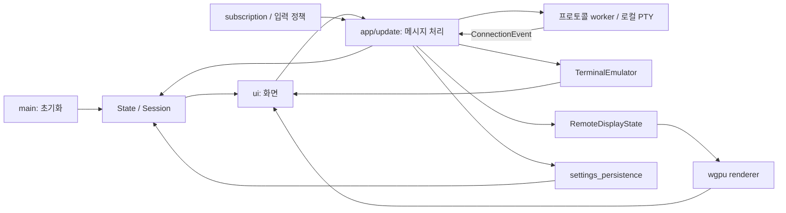

# 구조와 구현 현황

현재 구현은 이 문서에서, 추가 기능·검증 계획은 [개발·검증 계획](development-plan.md), 실행 방법은 [README](../README.md)에서 관리합니다.

- 정리일: 2026-10-06, 한국 시간 기준입니다.
- 현재 버전: kterm 0.1.2입니다. 분석 출발점은 commit `6f4ec55d3d084746febf14ae2e0815875107c0b0`이며 이후 의존성·API 변경을 반영했습니다.
- **확인**은 소스·의존성·실행 결과, **기존 기록**은 과거 문서의 검증 기록, **추론**은 예상 영향입니다. 문서 통합 후 의존성을 업그레이드하고 RDP API 호환 코드를 수정했습니다. 현재 검증·예외는 개발 계획에 기록합니다.

## 모듈과 데이터 흐름

`iced`의 상태·메시지·update·view 흐름을 사용합니다. 연결 모듈은 공통 이벤트를 발행하고 앱은 세션 ID로 해당 화면에 반영합니다.



| 위치 | 역할 |
|---|---|
| [main.rs](../src/main.rs) | 초기화, 폰트·설정 로드, window, 로그와 RDP 해상도 preset입니다. |
| [model.rs](../src/app/model.rs), [state.rs](../src/app/state.rs), [message.rs](../src/app/message.rs) | `Session`, 프로토콜·설정 종류, 전역 상태와 메시지입니다. |
| [update.rs](../src/app/update.rs) | 연결 시작, 세션 ID 라우팅, 입력 송신과 화면·설정·탭 상태 변경입니다. |
| [subscription.rs](../src/app/subscription.rs) | 화면별 keyboard·mouse·IME·window 이벤트 수집입니다. |
| [local_shell.rs](../src/app/local_shell.rs) | COMSPEC·PATH에서 셸을 탐지하고 선택 목록을 구성합니다. |
| [settings_persistence.rs](../src/app/settings_persistence.rs) | `SettingsData` 변환, JSON 읽기·쓰기, 기본값 처리입니다. |
| [view.rs](../src/ui/view.rs), [settings.rs](../src/ui/settings.rs) | Welcome·terminal·원격 화면·설정·탭·창 컨트롤입니다. |
| [terminal.rs](../src/terminal.rs) | `vte` 파싱 후 grid·history·cursor·style·selection·reflow와 Canvas·IME 위젯입니다. |
| [connection/mod.rs](../src/connection/mod.rs) | 공통 이벤트·입력과 프로토콜 모듈입니다. |
| [remote_input_policy.rs](../src/connection/remote_input_policy.rs) | scancode·Unicode·lock key·secure attention 정책입니다. |
| [remote_display/mod.rs](../src/remote_display/mod.rs) | Full/Rect, RGBA 상태와 dirty rectangle·full-upload 판단입니다. |
| [renderer.rs](../src/remote_display/renderer.rs), [remote_display.wgsl](../src/remote_display/remote_display.wgsl) | GPU texture 업로드, source·frame 변경 추적과 화면비 유지입니다. |
| [windows.rs](../src/platform/windows.rs) | 로컬 PTY와 Windows RDP clipboard backend 생성·정리입니다. |

### 세션과 연결 계약

`SessionKind`는 Welcome·Terminal·RemoteDisplay·Settings입니다. 실행 중 `Session`에는 ID, 이름, terminal, remote display, protocol 표식과 입력 sender가 있습니다. 저장 연결 프로필이나 명시적인 연결 수명주기 상태는 없습니다. Welcome 입력값과 protocol 선택은 전역 `State`에서 공유합니다.

`ConnectionEvent`는 Connected·Data·Frames·Disconnected·Error이고, `ConnectionInput`은 Data·Resize·RemoteInput·SyncKeyboardIndicators·ReleaseAllModifiers·Shutdown입니다. terminal은 바이트를, 원격 화면은 scancode·Unicode·mouse 입력을 주로 사용합니다. Resize의 cols/rows는 terminal에서 문자 수, 원격 화면에서 pixel 크기입니다.

연결 이벤트는 `Task::run`의 stream으로 앱에 전달됩니다. SSH·Telnet·Serial·PTY는 unfold 기반 상태를, RDP/VNC는 Tokio worker와 채널을 사용합니다. 구조가 같다고 종료·재시도 정책도 같지는 않습니다.

### terminal 경로

1. worker의 Data를 세션 ID로 찾아 `TerminalEmulator::process_bytes`에 전달합니다.
2. `vte::Parser`가 `TerminalPerformer` callback을 호출해 셀·cursor·style·history를 바꿉니다.
3. pending terminal 응답을 sender에 돌려보내고 Canvas cache를 무효화합니다.
4. `TerminalView`가 화면 크기를 행·열로 환산하고 선택·스크롤·IME cursor 위치를 처리합니다.

`vte`는 parser이며 terminal mode·grid semantics는 직접 구현합니다. 셀은 문자 하나와 색상·속성을 보관하고 wide character 뒤에는 NUL continuation cell을 사용합니다. history 상한은 10,000줄이며 폰트·셀 크기는 고정입니다.

### 원격 화면·입력 경로

RDP/VNC의 `FrameUpdate`를 `RemoteDisplayState::apply_batch`에 반영합니다. RGBA는 `Arc<Vec<u8>>` 기반이며 `source_id`는 세션 간 texture 혼합을 방지하고 `frame_seq`는 중복 업로드를 줄입니다. 첫 rect-only 배치와 큰 rect 배치는 full upload로 승격합니다.

Renderer는 full 또는 dirty rectangle을 texture에 업로드하고 WGSL에서 화면비를 유지합니다. 공통 keyboard 정책 뒤 RDP는 FastPath 입력, VNC는 key/pointer 이벤트로 변환합니다. mouse 좌표는 현재 고정 sidebar·header offset으로 계산합니다. pane별 viewport·focus 정책은 없습니다.

## 프로토콜별 구현

| 프로토콜 | 현재 구현 | 누락·검증 상태 |
|---|---|---|
| [SSH](../src/connection/ssh.rs) | `russh` password 인증, PTY/shell, keepalive, window change입니다. | 서버 키 무조건 수락, 개인키·agent·MFA·파일 전송·forwarding 없음, EOF/close 처리 부족입니다. |
| [Telnet](../src/connection/telnet.rs) | `nectar` codec, TCP 송수신, IAC escape, NAWS 전송입니다. | 옵션 이벤트를 대부분 무시하고 echo·line ending 설정이 반영되지 않습니다. 평문 통신입니다. |
| [Serial](../src/connection/serial.rs) | 비동기 read/write split, data bits·stop bits·parity·hardware flow control입니다. | 실물 검증, 포트 탐색·break·신호 제어가 남아 있습니다. |
| 로컬 PTY | 탐지한 CMD·PowerShell·Bash 실행, reader thread, 입력·resize입니다. | 셸 설정 적용·자식 종료 확인·EOF 전파가 부족하며 자체 Unix runtime은 없습니다. |
| [RDP](../src/connection/rdp.rs) | DNS/TCP → connect_begin → TLS → 공개키 추출 → connect_finalize → ActiveStage입니다. | TLS 신뢰, domain·오류 분류·취소·재접속·종료가 부족합니다. |
| [VNC](../src/connection/vnc.rs) | TCP timeout, 인증, ZRLE·Tight·Raw·DesktopSizePseudo, 선택적 CopyRect·CursorPseudo, view-only·shared·재시도입니다. | JPEG·OS clipboard·SetDesktopSize와 서버별 검증이 남아 있습니다. |

### RDP 상세

- 초기 해상도는 Welcome preset에서 선택합니다. 1280×720 고정이라는 과거 기록은 현재와 다릅니다.
- FastPath·slow-path bitmap fallback, RDP6 32bpp·RLE 16/24bpp·비압축 pixel 변환과 RemoteFX 경로가 있습니다. NSCodec은 현재 협상하지 않습니다.
- GFX PDU는 ironrdp-egfx에서 가져옵니다. Drdynvc의 `GfxProcessor`에 ZGFX 처리·surface 생성/삭제/매핑·frame acknowledge와 Uncompressed WireToSurface1 경로가 있습니다. 다른 codec과 일부 명령은 처리하지 않습니다.
- NLA 옵션을 `enable_credssp`에 전달합니다. domain과 Kerberos config는 `None`이며 TLS 신뢰는 별개입니다.
- Windows `WinClipboard`와 `CliprdrClient`가 연결됩니다. **기존 기록:** Windows 텍스트 양방향 복사·붙여넣기를 확인했습니다. 업그레이드된 backend의 파일 메시지도 CLIPRDR에 전달하지만 파일·이미지의 실제 동작은 미검증입니다. Linux/macOS backend는 구현 대상입니다.
- rdpsnd와 native audio backend 코드가 있으나 실제 재생 테스트 완료 기록은 없습니다.
- Unicode commit·scancode·mouse·수직/수평 휠·Ctrl+Alt+End alias가 있습니다. NumPad/Navigation 충돌 키 직전에 lock state를 sync합니다.
- **기존 기록:** XRDP/LXQt desktop 전환에서 lock-state PDU가 관측되지 않아 선행 sync를 적용했습니다. 이를 모든 서버의 동작으로 확대 해석하지 않습니다.

### VNC 상세

원본 framebuffer에 RawImage·CopyRect를 반영하고 cursor overlay를 합성합니다. 주기 Refresh와 healing FullRefresh, rect 배치 병합·full-upload 승격, 성능 계측 경로가 있습니다. 튜닝값 일부는 전역 설정으로 변경할 수 있습니다.

자동 재시도는 설정이 켜진 경우 오류 분류와 지수 backoff를 사용합니다. TCP connect만 timeout으로 감싸며 handshake·재시도 대기·연결 전 취소 정책은 부족합니다. 서버 크기 변경 수신과 클라이언트 SetDesktopSize 요청은 다른 기능입니다. 현재 Resize는 FullRefresh만 요청합니다.

## 설정과 저장

기본값과 다른 필드만 실행 파일 옆 JSON에 저장합니다. 파일 미존재·read/parse 실패 시 기본값으로 시작하고 write 실패는 로그만 남깁니다. text 변경마다 update에서 동기 write를 호출하며 atomic replace·debounce·schema version은 없습니다. 연결 profile과 비밀번호는 포함되지 않습니다.

| 상태 | 설정 |
|---|---|
| 연결에 반영됩니다. | SSH keepalive·terminal type, Serial data/stop bits·parity·flow control, RDP NLA·audio·color depth·font smoothing·composition, VNC cursor·CopyRect·shared·view-only·TCP timeout·튜닝값입니다. |
| VNC에만 반영됩니다. | 전역 AutoReconnect입니다. |
| 저장되지만 실행에 반영되지 않습니다. | CommonTimeout, SSH UseAgentForwarding, Telnet LineEnding·EchoLocally, Local DefaultShell·StartupArgs·LoginMode, CompactTabStyle입니다. |
| 화면 placeholder입니다. | Theme 폰트·색상, View/Help 더미 항목입니다. |

## 확인된 문제

이 절은 사실과 예상 영향을 기록합니다. 수정 순서·완료 조건은 [개발 우선순위](development-plan.md#개발-우선순위)에서 관리합니다.

| ID | 확인한 사실 | 영향·추론 |
|---|---|---|
| SEC-01 | `ssh.rs:18`의 check_server_key가 공개키를 사용하지 않고 Ok(true)를 반환합니다. | known_hosts·최초 신뢰·변경 키 차단이 필요합니다. 실제 공격은 재현하지 않았습니다. |
| SEC-02 | `rdp.rs`의 connect가 사용하는 ironrdp-tls 0.2.2 rustls backend가 인증서·TLS signature 성공 assertion을 반환합니다. | NLA와 TLS 신뢰는 별개입니다. 정상 검증·사설 CA·pinning이 필요합니다. |
| SEC-03 | `vnc.rs:752`의 Text 내용이 Data → update info 로그 → 파일로 전달됩니다. | clipboard 비밀값이 로그에 남을 수 있습니다. 길이·방향만 기록해야 합니다. |
| TERM-01~04 | 아래 독립 실행에서 ECH·panic·alternate screen·한글 reflow 오류가 재현되었습니다. | 공통 terminal backend에 영향을 줄 수 있습니다. GUI 종료 자체는 재현하지 않았습니다. |
| LIFE-01 | `rdp.rs`의 handle_rdp_input에서 Shutdown은 Ok(())만 반환하고 worker 루프를 종료하지 않습니다. | 종료가 지연될 수 있습니다. 실제 누수는 미측정입니다. |
| LIFE-02 | 연결 전 sender가 없고 VNC handshake·retry sleep은 취소·전체 timeout이 부족합니다. | 연결 중 탭 닫기·인증 대기에서 취소가 지연될 수 있습니다. |
| LIFE-03 | Telnet·Serial 오류 후 초기 상태로 돌아갑니다. SSH EOF는 상태를 바꾸지 않고 PTY kill/wait는 명시적으로 관리하지 않습니다. | 재시도·상태 불일치·프로세스 종료 문제의 빈도와 누수는 미측정입니다. |
| RDP-01 | encode_resize 호출은 있으나 DisplayControlClient 등록이 없습니다. | ironrdp-session 0.11.0은 채널이 없으면 None을 반환합니다. 동적 resize가 미완입니다. |
| RDP-02 | GFX capability 광고보다 codec·명령 처리가 좁습니다. | 서버별 화면 누락 가능성을 검증하고 협상·fallback을 보완해야 합니다. |
| VNC-01 | Tight 협상 후 `vnc.rs:804`의 JpegImage를 무시합니다. | JPEG 영역 갱신이 누락될 수 있습니다. 모든 Tight 접속 실패를 뜻하지는 않습니다. |
| CFG-01 | 일부 저장 설정을 연결·layout에서 읽지 않습니다. | UI와 실제 동작이 다릅니다. |
| PERF-01 | unbounded 채널·frame clone·CSI별 파일 쓰기·설정 동기 write가 있습니다. | 대량 출력·고해상도에서 메모리·입력 지연 증가 가능성이 있습니다. 성능은 미측정입니다. |
| INPUT-01 | mouse 고정 offset, 원격 keyboard·CursorMoved의 viewport 제한 부재입니다. | 분할·sidebar·focus 변경에서 좌표·라우팅 오류가 예상됩니다. |

### terminal 재현 결과

2026-10-06 분석에서 원본 terminal.rs를 포함한 임시 Rust 실행 파일로 재현했습니다. 기존 iced·vte·unicode-width 빌드 라이브러리를 사용했으며 제품 소스·GUI·네트워크는 변경하거나 실행하지 않았습니다. `_`는 NUL continuation cell입니다.

| ID | 입력·조건 | 기대 | 관측 |
|---|---|---|---|
| TERM-01 | 1행 8열, `ABCDE\r\x1b[2C\x1b[1X` | `AB DE   ` | `ABDE    ` |
| TERM-02 | 1행 4열, `ABCD\x1b[K` | 정상 처리 | `terminal.rs:237`, index 4 / length 4 panic입니다. |
| TERM-03 | 1행 8열, `BASE\x1b[?1049h\rALT\x1b[?1049l` | `BASE    ` | `ALTE    ` |
| TERM-04 | 1행 6열 `가A` 출력 후 8열 resize | `가_A     ` | 변경 전 `가_A   `, 변경 후 `가 _A    ` |

ECH가 DCH처럼 뒤 셀을 당기며 행을 채운 cursor는 cols에 도달합니다. private mode 처리가 없고 reflow는 continuation cell을 중복 계산합니다. [XTerm Control Sequences](https://invisible-island.net/xterm/ctlseqs/ctlseqs.html)를 동작 기준으로 사용했습니다.

ConPTY 보정은 CUP/ECH의 일반 의미를 바꾸며 모든 terminal backend에 적용됩니다. 기존 “한글·잔상 완전 해결” 기록은 현재 보장할 수 없습니다. save/restore·DEC mode·application cursor/keypad·bracketed paste·mouse reporting·OSC·grapheme는 추가 검증 대상입니다.

### 유지할 설계와 과거 수정

세션 ID 라우팅, 공통 입력·이벤트, RDP/VNC renderer, source_id/frame_seq, clipboard factory, 설정 roundtrip 테스트는 유지할 자산입니다.

기존 drag 종료, wide cell cleanup, cache 무효화, 초기 rect-only frame의 full-upload 승격은 관련 코드가 있습니다. 과거 “무제한 history”, “모든 버그 해결”, “실사용 완료” 표현은 현재 보장으로 사용하지 않습니다. 원본은 [버그 수정 기록](archived/2026-10-06/docs/kterm_bug_resolution_report.md)에 있습니다.

## 의존성과 라이선스

### 직접 의존성

다음 명령의 resolve graph로 2026-10-06 Windows x64 직접 의존성을 확인했습니다. 요구 범위가 아니라 lockfile에서 선택한 버전입니다.

```powershell
cargo metadata --locked --offline --format-version 1 --filter-platform x86_64-pc-windows-msvc
```

| Crate | 버전 | 메타데이터의 license |
|---|---|---|
| bytemuck | 1.25.2 | Zlib OR Apache-2.0 OR MIT |
| bytes | 1.12.1 | MIT |
| chrono | 0.4.45 | MIT OR Apache-2.0 |
| env_logger | 0.11.11 | MIT OR Apache-2.0 |
| futures | 0.3.34 | MIT OR Apache-2.0 |
| iced | 0.14.0 | MIT |
| ironrdp | 0.17.0 | MIT OR Apache-2.0 |
| ironrdp-cliprdr | 0.7.0 | MIT OR Apache-2.0 |
| ironrdp-cliprdr-native | 0.7.0 | MIT OR Apache-2.0 |
| ironrdp-core | 0.2.1 | MIT OR Apache-2.0 |
| ironrdp-dvc | 0.8.0 | MIT OR Apache-2.0 |
| ironrdp-egfx | 0.3.0 | MIT OR Apache-2.0 |
| ironrdp-input | 0.7.0 | MIT OR Apache-2.0 |
| ironrdp-rdpsnd | 0.9.0 | MIT OR Apache-2.0 |
| ironrdp-rdpsnd-native | 0.7.0 | MIT OR Apache-2.0 |
| ironrdp-tls | 0.2.2 | MIT OR Apache-2.0 |
| ironrdp-tokio | 0.10.0 | MIT OR Apache-2.0 |
| log | 0.4.34 | MIT OR Apache-2.0 |
| nectar | 0.4.0 | MIT OR Apache-2.0 |
| picky-krb | 0.12.4 | MIT OR Apache-2.0 |
| portable-pty | 0.9.0 | MIT |
| russh | 0.55.0 | Apache-2.0 |
| serde | 1.0.229 | MIT OR Apache-2.0 |
| serde_json | 1.0.151 | MIT OR Apache-2.0 |
| tokio | 1.53.2 | MIT |
| tokio-serial | 5.5.0 | MIT |
| tokio-util | 0.7.19 | MIT |
| unicode-width | 0.2.2 | MIT OR Apache-2.0 |
| vnc-rs | 0.6.0 | MIT OR Apache-2.0 |
| vte | 0.15.0 | Apache-2.0 OR MIT |
| windows-sys | 0.61.2 | MIT OR Apache-2.0 |

역할은 위 모듈·프로토콜 설명에 연결되어 있습니다. 미사용 russh-keys와 직접 async-trait 선언은 제거했습니다. ironrdp-egfx는 이동된 GFX PDU 타입을 사용하기 위해 추가했으며 OpenH264 feature는 켜지 않았습니다. picky-krb는 sspi와의 호환성을 유지하는 직접 버전 제약입니다. 이 표는 전체 간접 의존성 고지 목록은 아니며 릴리즈마다 metadata·lockfile·license 스캔을 확인하셔야 합니다. 적용 예외는 [업그레이드 기록](development-plan.md#의존성-업그레이드-기록)에 있습니다.

### MPL-2.0과 간접 의존성

**확인:** serialport 4.10.1은 MPL-2.0이며 tokio-serial의 간접 의존성입니다. tokio-serial로 바꿔 제거되었다는 과거 기록은 현재와 다릅니다. self_cell 1.3.0는 `Apache-2.0 OR GPL-2.0-only`입니다. license 선택과 배포 구성은 스캔·원문으로 확인하셔야 합니다.

MPL 코드를 변경하지 않고 직접 컴파일하여 외부 배포하는 경우에도 해당 MPL source를 얻을 위치를 안내해야 합니다. 수정했다면 MPL 대상 변경·고지·source 제공을 함께 점검하셔야 합니다. MPL 코드가 포함되지 않는 새 파일까지 자동으로 MPL이 적용되는 것은 아닙니다. [Mozilla MPL FAQ Q8·Q9·Q10·Q11](https://www.mozilla.org/en-US/MPL/2.0/FAQ/)과 [MPL 원문](license/LICENSE-MPL-2.0)을 기준으로 확인하셔야 합니다.

### 프로젝트·폰트 고지와 스캔 상태

- 프로젝트: [MIT](license/LICENSE-MIT), [Apache-2.0](license/LICENSE-APACHE), [안내](license/LICENSE)입니다.
- MPL 원문: [LICENSE-MPL-2.0](license/LICENSE-MPL-2.0)입니다.
- D2Coding: [OFL 원문](../assets/fonts/OFL-1.1.txt), [폰트 고지](../assets/fonts/D2Coding-LICENSE-NOTICE.txt)입니다.
- [deny.toml](../deny.toml)은 allowlist·exception을 선언합니다. 고지·source 제공 완료를 의미하지는 않습니다.
- **업그레이드 검증:** `cargo deny check licenses`가 통과했습니다. allowlist의 OpenSSL이 현재 graph에 없어 license-not-encountered 경고가 있습니다. 최초 문서 통합의 offline 실패와 과거 unescaper 경고는 현재 결과와 구분합니다. 과거 기록은 [원본](archived/2026-10-06/THIRD_PARTY_LICENSES.md)에 보관합니다.

## 근거와 갱신 원칙

source 행 번호는 기준 commit입니다. 업그레이드 후 TLS는 Cargo registry의 `ironrdp-tls-0.2.2/src/rustls.rs`, resize는 `ironrdp-session-0.11.0/src/active_stage.rs`, Serial 간접 의존성은 metadata에서 재확인했습니다. 최초 분석의 source 행 번호는 API 변경으로 달라질 수 있습니다.

기능 변경 시 이 문서의 구현·제약과 개발 계획의 검증 결과를 함께 갱신하셔야 합니다. 코드 구현만으로 실서버 검증까지 완료 처리하지 않으셔야 합니다. 이번 업그레이드에서 ironrdp-egfx 0.3.0 게시와 PDU 이동을 확인했습니다. codec 추가 기능은 활성화하지 않았으며 과거 “게시 대기” 기록을 현재 사실로 사용하지 않습니다.
