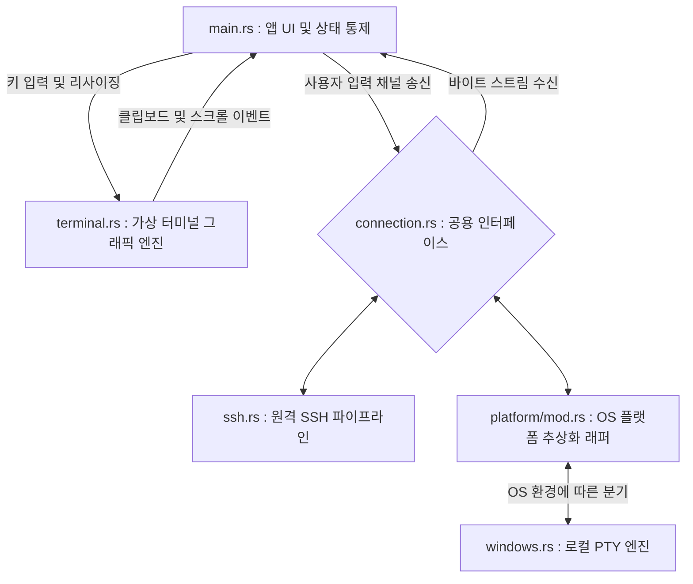

# KTerm 아키텍처 및 크레이트 의존성 구조 (Architecture Overview)

본 문서는 현재 `kterm` (네이티브 터미널 에뮬레이터) 프로젝트가 어떠한 외부 라이브러리(크레이트)에 의존하고 있으며, 내부 모듈들이 어떻게 유기적으로 결합되어 동작하는지를 분석한 구조도입니다.

---

## 🏗️ 1. 핵심 크레이트(Crate) 구성 및 역할

KTerm은 최신 모던 GUI 생태계와 비동기 네트워킹을 결합하기 위해 다음의 4대 기둥 메인 크레이트를 사용합니다.

### 🖼️ UI 및 그래픽 렌더링 (Frontend)
- **`iced` (0.14.0)**: KTerm의 핵심 프론트엔드 GUI 프레임워크입니다. Elm 아키텍처(`Model-Update-View`)를 채택하여 상태 관리를 돕고, `canvas` 기능을 이용해 터미널 내부 엔진의 결과물을 저수준 하드웨어 가속(GPU)으로 빠르게 화면에 그려냅니다.

### 🖧 네트워크 및 로컬 통신 (Backend)
- **`russh` (0.58.0) 및 `russh-keys`**: 순수 Rust로 작성된 고성능 SSH 클라이언트 라이브러리입니다. 원격 서버 접속을 담당합니다.
- **`portable-pty` (0.9.0)**: 로컬 호스트(PC) 자체의 터미널(PowerShell, CMD 등) 프로세스를 백그라운드에서 스폰(Spawn)하고 네이티브 PTY(가상 터미널) 입출력을 터미널 그래픽 엔진으로 직결시켜주는 핵심 크레이트입니다.
- **`tokio` (1.50.0)**: 비동기 런타임의 표준으로, UI 동작을 방해하지 않게 백그라운드 환경에서 SSH 및 로컬 PTY 파이프라인 데이터를 펌핑합니다.

### 💻 터미널 파서 및 문자열 해석 (Core Engine)
- **`vte` (0.15.0)**: 고속 터미널 이스케이프 시퀀스 파서입니다. 쉘(서버)에서 들어오는 바이트 스트림을 실시간으로 읽어들여 액션으로 변환합니다.
- **`unicode-width` (0.2.2)**: 한글 등 동아시아 문자(Wide-character)의 화면 논리적 크기를 산정합니다.

> **(참고: 잔재 의존성 및 예비 크레이트)**
> `Cargo.toml`에 존재하는 `egui`, `eframe` 등은 초기 기획 시도 후 `Iced`로 전면 개편되면서 현재는 사용되지 않는 레거시 크레이트입니다. 반면 `nectar`는 향후 Telnet 통신 지원을 위해, `serialport`는 Serial 통신을 지원하기 위해 준비되어 있는 크레이트입니다.

---

## 🧩 2. 내부 모듈 간 결합 구조 (Internal Modules)

KTerm은 핵심적인 **5개의 독립 모듈**로 분리되어 상호작용합니다.



### 1) 알맹이 로직: `terminal.rs` (Terminal Emulator)
상태 구조체인 `TerminalEmulator`가 터미널 렌더링에 필요한 모든 것(Grid 2차원 배열, Cursor 상태, 텍스트 복사 상태, ConPTY 방어 알고리즘 등)을 보유합니다.
- `vte` 크레이트의 `Perform` 트레이트를 여기서 직접 오버라이딩(Overriding)합니다.
- Iced의 `Program` 트레이트를 구현항 `TerminalView`를 통해, `TerminalEmulator`가 가진 데이터를 화면 픽셀로 변환(그리기)하는 역할을 직접 수행합니다.

### 2) 공용 인터페이스 계층: `connection.rs` (Polymorphic Interface)
다양한 프로토콜(SSH, Local, 향후 추가될 Telnet 등)이 터미널 그래픽 엔진(`main.rs`)과 완벽히 격리되어 호환될 수 있도록 만들어진 공용 열거형 껍데기입니다. 
- `ConnectionEvent` 및 `ConnectionInput` 구조체를 담고 있으며, 이를 통해 모든 후속 통신 모듈들은 동일한 반환값과 입력 포맷을 가지는 강제적 다형성(Polymorphism)을 띠게 됩니다.

### 3) 백엔드 통신망: `ssh.rs` 및 `platform/mod.rs` (Backend Pipelines)
공통 인터페이스(`connection.rs`) 규격을 구현한 실제 백그라운드 파이프라인 모듈들입니다. UI 스레드 개입 없이 별개의 비동기 환경에서 작동합니다.
- **SSH (`ssh.rs`)**: `russh` 클라이언트를 감싸고 무한 스레드를 구성하여 서버 데이터를 `ConnectionEvent::Data`로 우회 방출합니다.
- **OS 플랫폼 추상화 (`platform/mod.rs`)**: 윈도우, 리눅스, 맥OS 등 각 운영체제별로 서로 다른 네이티브 기능들을 통합 호출하기 위해 마련된 래퍼(Wrapper) 껍데기 모듈입니다.
   - **Local PTY (`windows.rs`)**: `platform/mod.rs` 하위에서 작동하며, 현재 윈도우 한정으로 `portable-pty`를 이용해 사용자가 선택한 셸(`pwsh/powershell/cmd/bash`) 프로세스를 백그라운드 스폰하는 로컬 가상 터미널 엔진입니다.

### 4) 뇌(Brain)와 중추 신경: `main.rs` (Entry Point & UI Routing)
- Iced Application(`State` 구조체)이 초기화됩니다. 
- 현재 열려있는 다중 세션들(`Vec<Session>`)과 탭 정보, 창 관리(ID 캡처), 테마 및 보더리스(Borderless) 헤더 UI를 그려냅니다.
- 키보드/마우스 입력이나 리사이징 데이터가 1차적으로 도달하면, 이를 판단하여 현재 활성화된(Active) `terminal.rs` 객체에 처리를 위임하거나, `ssh.rs` 쪽으로 이벤트를 중계합니다.

---

## 🔄 3. 데이터 플로우 (Data Flow LifeCycle)

```text
[사용자 타건: 'L', 'S', 'Enter']
   │
   ▼
[main.rs] Iced Keyboard Event 캡처 -> 활성 터미널 세션의 mpsc 송신기로 전달
   │
   ▼
[ssh.rs] Tokio 기반 Russh Client가 채널 읽기 -> 서버에 전달
   │
   ▼
[서버 (ConPTY 등)] 명령 실행 후 결과 출력 Байт(Bytes) 스트림 송신
   │
   ▼
[ssh.rs] 결과를 SshEvent::Data로 포장 -> Iced 구독(Subscription) 통해 방출
   │
   ▼
[main.rs] Message 수신 -> 활성 터미널의 `terminal.process_bytes(&data)` 호출!
   │
   ▼
[terminal.rs] vte Parser 작동. "\x1b[32m" (색상) 등은 상태 변경, "hello" 등은 Grid에 인쇄
   │
   ▼
[main.rs] 데이터 처리 직후 `cache.clear()` 발동! -> Iced에 화면 새로고침(Re-render) 요청
   │
   ▼
[terminal.rs / Canvas] 변경된 Grid를 화면에 출력 (사용자 눈에 보임)
```
