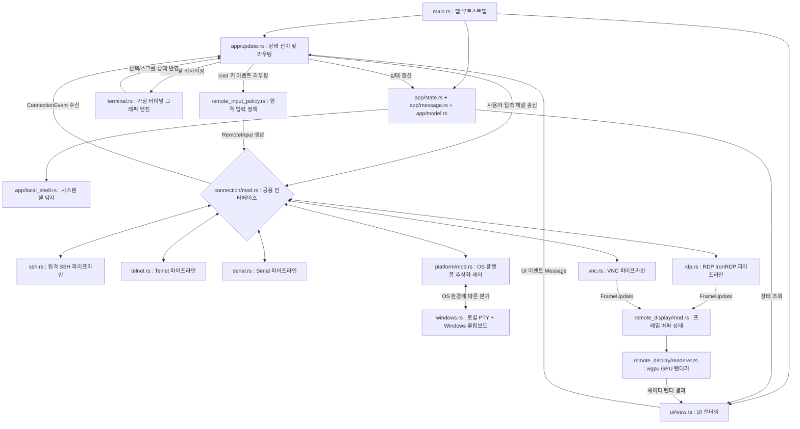

# KTerm 아키텍처 및 크레이트 의존성 구조 (Architecture Overview)

본 문서는 현재 `kterm` (네이티브 터미널 에뮬레이터) 프로젝트가 어떠한 외부 라이브러리(크레이트)에 의존하고 있으며, 내부 모듈들이 어떻게 유기적으로 결합되어 동작하는지를 분석한 구조도입니다.

---

## 🏗️ 1. 핵심 크레이트(Crate) 구성 및 역할

KTerm은 최신 모던 GUI 생태계와 비동기 네트워킹을 결합하기 위해 다음의 4대 기둥 메인 크레이트를 사용합니다.

### 🖼️ UI 및 그래픽 렌더링 (Frontend)
- **`iced` (0.14.0)**: KTerm의 핵심 프론트엔드 GUI 프레임워크입니다. Elm 아키텍처(`Model-Update-View`)를 채택하여 상태 관리를 돕고, `canvas` 기능을 이용해 터미널 내부 엔진의 결과물을 저수준 하드웨어 가속(GPU)으로 빠르게 화면에 그려냅니다.

### 🖧 네트워크 및 로컬 통신 (Backend)
- **`russh` (0.55.0) 및 `russh-keys`**: 순수 Rust로 작성된 SSH 클라이언트 라이브러리입니다. 원격 서버 접속을 담당합니다. `ironrdp`와의 `sha1` 의존성 충돌로 인해 0.55.0으로 고정되어 있습니다.
- **`ironrdp` (0.14.0) 및 관련 크레이트**: RDP 프로토콜 구현 라이브러리 스택입니다. `ironrdp-tokio`(비동기 I/O 및 핸드셰이크), `ironrdp-tls`(TLS 업그레이드·인증서 추출), `ironrdp-core`(PDU 디코딩), `ironrdp-input`(키보드·마우스 입력 매핑), `ironrdp-dvc`(동적 가상 채널 인프라), `ironrdp-rdpsnd`/`ironrdp-rdpsnd-native`(오디오 채널), `ironrdp-cliprdr`/`ironrdp-cliprdr-native`(클립보드 공유)가 함께 사용됩니다.
- **`portable-pty` (0.9.0)**: 로컬 호스트(PC) 자체의 터미널(PowerShell, CMD 등) 프로세스를 백그라운드에서 스폰(Spawn)하고 네이티브 PTY(가상 터미널) 입출력을 터미널 그래픽 엔진으로 직결시켜주는 핵심 크레이트입니다.
- **`tokio-serial` (5.4.4)** 및 **`nectar` (0.4.0)**: 각각 Serial 포트 비동기 접속(`tokio_serial::SerialStream` + `tokio::io::split`)과 Telnet 프로토콜 처리를 담당하는 크레이트입니다.
- **`tokio` (1.50.0)**: 비동기 런타임의 표준으로, UI 동작을 방해하지 않게 백그라운드 환경에서 SSH, RDP, VNC, 로컬 PTY 파이프라인 데이터를 펌핑합니다.
- **`vnc-rs` (0.5.3)**: VNC 클라이언트 구현에 사용하는 라이브러리입니다. VNC 핸드셰이크/인코딩 수신/입력 이벤트 송신을 담당합니다.

### 💻 터미널 파서 및 문자열 해석 (Core Engine)
- **`vte` (0.15.0)**: 고속 터미널 이스케이프 시퀀스 파서입니다. 쉘(서버)에서 들어오는 바이트 스트림을 실시간으로 읽어들여 액션으로 변환합니다.
- **`unicode-width` (0.2.2)**: 한글 등 동아시아 문자(Wide-character)의 화면 논리적 크기를 산정합니다.

> **(참고: wgpu 렌더러)**
> `iced`는 `wgpu` feature를 활성화하여 RDP 화면 렌더링에 GPU 가속을 제공합니다. `bytemuck`은 GPU uniform 버퍼 직렬화에 사용됩니다.

---

## 🧩 2. 내부 모듈 간 결합 구조 (Internal Modules)

KTerm은 핵심적인 **6개의 독립 모듈**로 분리되어 상호작용합니다.



### 1) 알맹이 로직: `terminal.rs` (Terminal Emulator)
상태 구조체인 `TerminalEmulator`가 터미널 렌더링에 필요한 모든 것(Grid 2차원 배열, Cursor 상태, 텍스트 복사 상태, ConPTY 방어 알고리즘 등)을 보유합니다.
- `vte` 크레이트의 `Perform` 트레이트를 여기서 직접 오버라이딩(Overriding)합니다.
- Iced의 `Program` 트레이트를 구현한 `TerminalView`를 통해, `TerminalEmulator`가 가진 데이터를 화면 픽셀로 변환(그리기)하는 역할을 직접 수행합니다.

### 2) 공용 인터페이스 계층: `connection/mod.rs` (Polymorphic Interface)
다양한 프로토콜(SSH, Telnet, Serial, Local, RDP, VNC)이 앱 계층(`app/update.rs`, `ui/view.rs`)과 공통 타입으로 통신할 수 있도록 만든 인터페이스 계층입니다. 다만 원격 디스플레이(RDP/VNC)는 입력 수집과 렌더링 경로 일부를 공유하므로, 완전히 독립된 파이프라인은 아닙니다.
- `ConnectionEvent`(Connected/Data/Frames/Disconnected/Error) 및 `ConnectionInput`(Data/Resize/SyncKeyboardIndicators/ReleaseAllModifiers/RemoteInput) 구조체를 담고 있으며, 이를 통해 모든 프로토콜 모듈이 동일한 반환값과 입력 포맷을 가지는 강제적 다형성(Polymorphism)을 띠게 됩니다.

### 3) 백엔드 통신망: 각 프로토콜 파이프라인 (Backend Pipelines)
공통 인터페이스(`connection/mod.rs`) 규격을 구현한 실제 백그라운드 파이프라인 모듈들입니다. UI 스레드 개입 없이 별개의 비동기 환경에서 작동합니다.
- **SSH (`ssh.rs`)**: `russh` 클라이언트를 감싸고 비동기 스트림으로 서버 데이터를 `ConnectionEvent::Data`로 방출합니다.
- **Telnet (`telnet.rs`)**: `nectar` 기반 Telnet codec 처리 및 NAWS 윈도우 크기 협상을 담당합니다.
- **Serial (`serial.rs`)**: `tokio-serial` 기반 비동기 Serial 스트림. `tokio::io::split`으로 읽기/쓰기 반분할 후 `tokio::select!`로 입출력을 동시 처리합니다.
- **RDP (`rdp.rs`)**: `ironrdp` 기반 `ironrdp-tokio` 비동기 핸드셰이크, `tokio::select!` 기반 이벤트 드리븐 `ActiveStage` PDU 루프, FastPath/Slow-path 비트맵 디코딩(RDP6/RLE 16·24bpp/BGRX/RGB565), EGFX DVC 프로세서(`GfxProcessor`), CLIPRDR 클립보드 공유(`CliprdrClient` 정적 채널 + OS 이벤트 처리 루프)를 담당합니다. `ironrdp-input`의 `Database`/`Operation`/`Scancode` 타입으로 입력을 처리하며, XRDP 계열 서버의 NumLock 불일치를 완화하기 위해 NumPad/Navigation 충돌 스캔코드 입력 직전에만 `TS_SYNC_EVENT`를 선행 전송합니다. 비동기 Tokio 태스크(`tokio::spawn`)에서 실행됩니다.
- **VNC (`vnc.rs`)**: `vnc-rs` 기반 비동기 워커(`tokio::spawn`)에서 연결/인증/이벤트 루프를 처리합니다. `CopyRect`, `Raw`, `DesktopSizePseudo`, `CursorPseudo` 인코딩을 협상하고, `SetResolution`/`RawImage`/`Copy`/`SetCursor` 이벤트를 `FrameUpdate`로 변환해 공용 렌더러로 전달합니다. 초기 FullRefresh + 주기 Refresh/Healing FullRefresh를 사용하며, `RemoteInput`(키보드 스캔코드/유니코드, 마우스 이동/버튼/수직휠/수평휠) 및 `SyncKeyboardIndicators` 입력 동기화를 처리합니다.
- **원격 입력 정책 (`remote_input_policy.rs`)**: Iced 물리 키 이벤트를 RDP/VNC 입력으로 라우팅하는 정책 결정 모듈입니다. 스캔코드 매핑 테이블, Lock 키 감지, Ctrl+Alt+End → Secure Attention 변환, IME commit 문자열의 Unicode 입력 시퀀스 변환을 담당합니다.
- **OS 플랫폼 추상화 (`platform/mod.rs`)**: 현재 윈도우 한정으로 `platform/windows.rs`가 `portable-pty` 기반 로컬 가상 터미널 엔진과 `WinClipboard` 기반 CLIPRDR 백엔드 생성/정리 함수를 함께 제공합니다.
- **로컬 셸 탐지 (`app/local_shell.rs`)**: 시스템의 실행 가능한 셸(`pwsh/powershell/cmd/bash`)을 탐지해 Welcome UI의 선택 리스트를 구성합니다.

### 3-1) 원격 입력 공통층과 프로토콜 어댑터 경계
현재 RDP/VNC 입력 경로는 "완전 분리"가 아니라 "공통 정규화층 + 프로토콜별 송신 어댑터" 구조입니다.

공통층:
- `app/subscription.rs`가 RemoteDisplay 탭의 키보드/마우스/포커스 이벤트를 공통으로 수집하고 `Message::RemoteDisplayInput`, `Message::SyncRemoteKeyboardIndicators`, `Message::ReleaseRemoteModifiers`를 생성합니다.
- `connection/remote_input_policy.rs`가 Iced 키 이벤트를 프로토콜 중립적인 `RemoteInput`으로 정규화합니다.
- `app/update.rs`가 공통 메시지를 받아 `ConnectionInput::RemoteInput`, `ConnectionInput::SyncKeyboardIndicators`, `ConnectionInput::ReleaseAllModifiers`로 워커 채널에 전달합니다.
- `app/update.rs`의 `transform_remote_mouse()`가 공통 뷰포트 기준 좌표 변환을 수행하므로, 마우스 좌표 정책도 상단에서는 공유됩니다.
- `SessionKind::RemoteDisplay` 하나로 RDP/VNC를 함께 표현하고, 두 프로토콜 모두 `RemoteDisplayState`를 공유합니다.
- 원격 디스플레이 프로토콜 판별은 `Session.remote_display_protocol`의 `RemoteDisplayProtocol::{Rdp,Vnc}`로 처리합니다.
- `remote_display/mod.rs`와 `remote_display/renderer.rs`는 RDP/VNC 모두가 생성한 `FrameUpdate`를 동일한 GPU 렌더 경로로 처리합니다.

프로토콜별 어댑터:
- `rdp.rs`는 공통 `ConnectionInput`을 `ironrdp-input::Operation`과 FastPath 입력 PDU로 변환합니다.
- `vnc.rs`는 동일한 `ConnectionInput`을 VNC X11 key/pointer 이벤트로 변환합니다.

현재 완전 분리로 보기 어려운 결합 지점:
- 프로토콜 비특정 bootstrap/large-batch full-upload fallback은 `app/update.rs`가 아니라 `remote_display/mod.rs`의 `RemoteDisplayState::apply_batch()`가 담당합니다.
- 포커스 획득/상실 시점의 lock-key sync와 modifier release는 공통 메시지로 처리되지만, 실제 의미와 변환 방식은 각 백엔드에서 다릅니다.

### 4) 원격 디스플레이 계층: `remote_display/` (RDP/VNC 공용 렌더러)
RDP/VNC 세션에서 수신한 픽셀 데이터를 화면에 표시하기 위한 공용 모듈입니다.
- **`mod.rs`**: `FrameUpdate`(Full/Rect) 타입과 `RemoteDisplayState`(Arc 기반 Copy-on-Write RGBA 프레임 버퍼, Dirty Rect 목록)를 정의합니다.
- **`mod.rs`**: 배치 적용 시 bootstrap/large rect batch를 공통 full-upload fallback으로 승격하는 `apply_batch()` 로직도 포함합니다.
- **`renderer.rs`**: `RemoteDisplayPipeline`(`shader::Pipeline` 구현)으로 wgpu GPU 텍스처를 관리합니다. Dirty Rect 단위로 부분 텍스처 업로드를 수행해 GPU 대역폭을 최소화합니다.
- **`remote_display.wgsl`**: 뷰포트/텍스처 크기 유니폼 기반 전체 화면 스케일링 WGSL 셰이더입니다.

### 5) 앱 오케스트레이션: `main.rs` + `app/*` + `ui/*`
- `main.rs`는 Iced application 부트스트랩과 공용 상수/로깅 초기화만 담당합니다.
- `app/state.rs`/`app/message.rs`/`app/model.rs`가 앱 상태/메시지/세션 모델을 정의합니다.
- `app/update.rs`가 세션 ID 기반 라우팅, 연결/입력/윈도우 메시지 처리, 백엔드 송신을 담당합니다.
- `ui/view.rs`가 Welcome/탭/원격디스플레이/설정 UI 렌더링을 담당하며, `app/subscription.rs`가 이벤트 수집을 담당합니다.
- Welcome 탭의 로컬 셸 목록은 `app/local_shell.rs` 탐지 결과를 사용합니다.

---

## 🔄 3. 데이터 플로우 (Data Flow LifeCycle)

**[SSH/Telnet/Serial/Local — 터미널 세션 경로]**
```text
[사용자 타건: 'L', 'S', 'Enter']
   │
   ▼
[app/subscription.rs] Iced Keyboard Event 캡처 -> Message::TerminalInput 생성
   │
   ▼
[app/update.rs] 활성 세션의 ConnectionInput::Data 채널 송신
   │
   ▼
[ssh.rs / telnet.rs / serial.rs / windows.rs] 백엔드가 원격/로컬에 전달
   │
   ▼
[서버 / 로컬 PTY] 명령 실행 후 결과 바이트 스트림 송신
   │
   ▼
[각 백엔드] 결과를 ConnectionEvent::Data로 포장 -> Iced Subscription 통해 방출
   │
   ▼
[app/update.rs] 세션 ID 기준 라우팅 -> 해당 터미널의 `terminal.process_bytes(&data)` 호출
   │
   ▼
[terminal.rs] vte Parser 작동. "\x1b[32m"(색상) 등은 상태 변경, "hello"는 Grid에 인쇄
   │
   ▼
[app/update.rs] cache.clear() 발동 -> [ui/view.rs] Iced Canvas 재렌더 요청 -> 화면 출력
```

**[RDP — 원격 그래픽 세션 경로]**
```text
[사용자 클릭/키 입력]
   │
   ▼
[app/subscription.rs] 입력 이벤트 캡처 -> Message::RemoteDisplayInput 생성
   │
   ▼
[app/update.rs] ConnectionInput::RemoteInput 채널 송신
   │
   ▼
[rdp.rs / 비동기 워커] NumPad/Navigation 충돌 키면 TS_SYNC_EVENT 선행 -> FastPath 입력 이벤트 인코딩 -> RDP 서버 전송
   │
   ▼
[RDP 서버] 화면 변경분을 FastPath/Slow-path 비트맵 Update PDU로 송신
   │
   ▼
[rdp.rs] PDU 디코딩 -> FrameUpdate::Rect{x,y,w,h,rgba} 생성 -> 배치 병합
   │
   ▼
[app/update.rs] ConnectionEvent::Frames 수신 -> RemoteDisplayState.apply() 호출
   │
   ▼
[remote_display/renderer.rs] 셰이더 프로그램 갱신 -> wgpu Dirty Rect 텍스처 업로드
   │
   ▼
[WGSL 셰이더] GPU 텍스처를 뷰포트에 스케일링 렌더링 -> 화면 출력
```

**[VNC — 원격 그래픽 세션 경로]**
```text
[사용자 클릭/키 입력]
   │
   ▼
[app/subscription.rs] 입력 이벤트 캡처 -> Message::RemoteDisplayInput 생성
   │
   ▼
[app/update.rs] ConnectionInput::RemoteInput / SyncKeyboardIndicators 채널 송신
   │
   ▼
[vnc.rs / 비동기 워커] 입력 이벤트 변환(VNC key/pointer) -> VNC 서버 전송
   │
   ▼
[VNC 서버] SetResolution/RawImage/Copy/SetCursor 이벤트 송신
   │
   ▼
[vnc.rs] 이벤트를 FrameUpdate(Full/Rect)로 변환 + 커서 오버레이/복원 처리
   │
   ▼
[app/update.rs] ConnectionEvent::Frames 수신 -> RemoteDisplayState.apply() 호출
   │
   ▼
[remote_display/renderer.rs] Dirty Rect 기반 부분 업로드 -> 화면 출력
```

참고:
테스트한 XRDP(LXQt) 서버는 로그인 화면에서 데스크톱으로 전환될 때 `DeactivateAll`, `SetKeyboardIndicators` 같은 세션/lock-state 전환 PDU를 보내지 않았습니다. 따라서 이 전환은 프로토콜 이벤트가 아니라 단순한 화면 업데이트 스트림으로만 관측되며, 현재 입력 선행 sync는 이 제약을 우회하기 위한 제한적 대응입니다.
