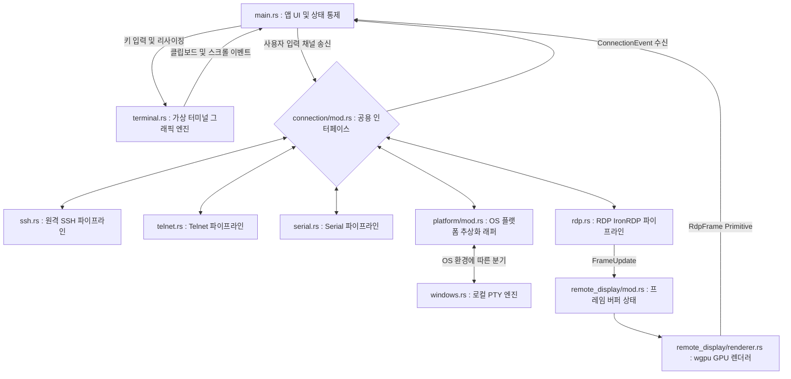

# KTerm 아키텍처 및 크레이트 의존성 구조 (Architecture Overview)

본 문서는 현재 `kterm` (네이티브 터미널 에뮬레이터) 프로젝트가 어떠한 외부 라이브러리(크레이트)에 의존하고 있으며, 내부 모듈들이 어떻게 유기적으로 결합되어 동작하는지를 분석한 구조도입니다.

---

## 🏗️ 1. 핵심 크레이트(Crate) 구성 및 역할

KTerm은 최신 모던 GUI 생태계와 비동기 네트워킹을 결합하기 위해 다음의 4대 기둥 메인 크레이트를 사용합니다.

### 🖼️ UI 및 그래픽 렌더링 (Frontend)
- **`iced` (0.14.0)**: KTerm의 핵심 프론트엔드 GUI 프레임워크입니다. Elm 아키텍처(`Model-Update-View`)를 채택하여 상태 관리를 돕고, `canvas` 기능을 이용해 터미널 내부 엔진의 결과물을 저수준 하드웨어 가속(GPU)으로 빠르게 화면에 그려냅니다.

### 🖧 네트워크 및 로컬 통신 (Backend)
- **`russh` (0.55.0) 및 `russh-keys`**: 순수 Rust로 작성된 SSH 클라이언트 라이브러리입니다. 원격 서버 접속을 담당합니다. `ironrdp`와의 `sha1` 의존성 충돌로 인해 0.55.0으로 고정되어 있습니다.
- **`ironrdp` (0.14.0) 및 관련 크레이트**: RDP 프로토콜 구현 라이브러리 스택입니다. `ironrdp-blocking`(TLS 핸드셰이크), `ironrdp-core`(PDU 디코딩), `ironrdp-rdpsnd`(오디오 채널), `sspi`(인증), `tokio-rustls`(TLS), `x509-cert`(인증서 파싱)가 함께 사용됩니다.
- **`portable-pty` (0.9.0)**: 로컬 호스트(PC) 자체의 터미널(PowerShell, CMD 등) 프로세스를 백그라운드에서 스폰(Spawn)하고 네이티브 PTY(가상 터미널) 입출력을 터미널 그래픽 엔진으로 직결시켜주는 핵심 크레이트입니다.
- **`tokio-serial` (5.4.4)** 및 **`nectar` (0.4.0)**: 각각 Serial 포트 비동기 접속(`tokio_serial::SerialStream` + `tokio::io::split`)과 Telnet 프로토콜 처리를 담당하는 크레이트입니다.
- **`tokio` (1.50.0)**: 비동기 런타임의 표준으로, UI 동작을 방해하지 않게 백그라운드 환경에서 SSH, RDP, 로컬 PTY 파이프라인 데이터를 펌핑합니다.

### 💻 터미널 파서 및 문자열 해석 (Core Engine)
- **`vte` (0.15.0)**: 고속 터미널 이스케이프 시퀀스 파서입니다. 쉘(서버)에서 들어오는 바이트 스트림을 실시간으로 읽어들여 액션으로 변환합니다.
- **`unicode-width` (0.2.2)**: 한글 등 동아시아 문자(Wide-character)의 화면 논리적 크기를 산정합니다.

> **(참고: wgpu 렌더러)**
> `iced`는 `wgpu` feature를 활성화하여 RDP 화면 렌더링에 GPU 가속을 제공합니다. `bytemuck`은 GPU uniform 버퍼 직렬화에 사용됩니다.

---

## 🧩 2. 내부 모듈 간 결합 구조 (Internal Modules)

KTerm은 핵심적인 **5개의 독립 모듈**로 분리되어 상호작용합니다.



### 1) 알맹이 로직: `terminal.rs` (Terminal Emulator)
상태 구조체인 `TerminalEmulator`가 터미널 렌더링에 필요한 모든 것(Grid 2차원 배열, Cursor 상태, 텍스트 복사 상태, ConPTY 방어 알고리즘 등)을 보유합니다.
- `vte` 크레이트의 `Perform` 트레이트를 여기서 직접 오버라이딩(Overriding)합니다.
- Iced의 `Program` 트레이트를 구현한 `TerminalView`를 통해, `TerminalEmulator`가 가진 데이터를 화면 픽셀로 변환(그리기)하는 역할을 직접 수행합니다.

### 2) 공용 인터페이스 계층: `connection/mod.rs` (Polymorphic Interface)
다양한 프로토콜(SSH, Telnet, Serial, Local, RDP)이 터미널 그래픽 엔진(`main.rs`)과 완벽히 격리되어 호환될 수 있도록 만들어진 공용 열거형 껍데기입니다. 
- `ConnectionEvent`(Connected/Data/Frames/Disconnected/Error) 및 `ConnectionInput`(Data/Resize/RdpInput) 구조체를 담고 있으며, 이를 통해 모든 프로토콜 모듈이 동일한 반환값과 입력 포맷을 가지는 강제적 다형성(Polymorphism)을 띠게 됩니다.

### 3) 백엔드 통신망: 각 프로토콜 파이프라인 (Backend Pipelines)
공통 인터페이스(`connection/mod.rs`) 규격을 구현한 실제 백그라운드 파이프라인 모듈들입니다. UI 스레드 개입 없이 별개의 비동기 환경에서 작동합니다.
- **SSH (`ssh.rs`)**: `russh` 클라이언트를 감싸고 비동기 스트림으로 서버 데이터를 `ConnectionEvent::Data`로 방출합니다.
- **Telnet (`telnet.rs`)**: `nectar` 기반 Telnet codec 처리 및 NAWS 윈도우 크기 협상을 담당합니다.
- **Serial (`serial.rs`)**: `tokio-serial` 기반 비동기 Serial 스트림. `tokio::io::split`으로 읽기/쓰기 반분할 후 `tokio::select!`로 입출력을 동시 처리합니다.
- **RDP (`rdp.rs`)**: `ironrdp` 기반 TLS 핸드셰이크, `ActiveStage` PDU 루프, FastPath/Slow-path 비트맵 디코딩, 입력 이벤트 매핑을 담당합니다. 블로킹 워커 스레드에서 실행되어 비동기 스트림으로 래핑됩니다.
- **OS 플랫폼 추상화 (`platform/mod.rs`)**: 현재 윈도우 한정으로 `portable-pty`를 이용해 사용자가 선택한 셸(`pwsh/powershell/cmd/bash`) 프로세스를 백그라운드 스폰하는 로컬 가상 터미널 엔진입니다.

### 4) 원격 디스플레이 계층: `remote_display/` (RDP/VNC 공용 렌더러)
RDP(및 미래의 VNC) 세션에서 수신한 픽셀 데이터를 화면에 표시하기 위한 공용 모듈입니다.
- **`mod.rs`**: `FrameUpdate`(Full/Rect) 타입과 `RemoteDisplayState`(Arc 기반 Copy-on-Write RGBA 프레임 버퍼, Dirty Rect 목록)를 정의합니다.
- **`renderer.rs`**: `RdpPipeline`(`shader::Pipeline` 구현)으로 wgpu GPU 텍스처를 관리합니다. Dirty Rect 단위로 부분 텍스처 업로드를 수행해 GPU 대역폭을 최소화합니다.
- **`rdp_display.wgsl`**: 뷰포트/텍스처 크기 유니폼 기반 전체 화면 스케일링 WGSL 셰이더입니다.

### 5) 뇌(Brain)와 중추 신경: `main.rs` (Entry Point & UI Routing)
- Iced Application(`State` 구조체)이 초기화됩니다. 
- 현재 열려있는 다중 세션들(`Vec<Session>`)과 안정적 세션 ID 기반 탭 라우팅, 창 관리(ID 캡처), 보더리스(Borderless) 헤더 UI를 그려냅니다.
- Welcome 탭에서 SSH/Telnet/Serial/Local Shell/RDP 프로토콜 선택 버튼과 프로토콜별 컨텍스트 입력 폼을 제공합니다.
- 키보드/마우스 입력이나 리사이징 데이터가 도달하면, 터미널 세션은 `TerminalEmulator`에, RDP 세션은 `ConnectionInput::RdpInput`으로 해당 파이프라인에 중계합니다.

---

## 🔄 3. 데이터 플로우 (Data Flow LifeCycle)

**[SSH/Telnet/Serial/Local — 터미널 세션 경로]**
```text
[사용자 타건: 'L', 'S', 'Enter']
   │
   ▼
[main.rs] Iced Keyboard Event 캡처 -> 활성 세션의 ConnectionInput::Data 채널 송신
   │
   ▼
[ssh.rs / telnet.rs / serial.rs / windows.rs] 백엔드가 원격/로컬에 전달
   │
   ▼
[서버 / 로컬 PTY] 명령 실행 후 결과 바이트 스트림 송신
   │
   ▼
[각 백엔드] 결과를 ConnectionEvent::Data로 포장 -> Iced Subscription 통해 방출
   │
   ▼
[main.rs] 세션 ID 기준 라우팅 -> 해당 터미널의 `terminal.process_bytes(&data)` 호출
   │
   ▼
[terminal.rs] vte Parser 작동. "\x1b[32m"(색상) 등은 상태 변경, "hello"는 Grid에 인쇄
   │
   ▼
[main.rs] cache.clear() 발동 -> Iced Canvas 재렌더 요청 -> 화면 출력
```

**[RDP — 원격 그래픽 세션 경로]**
```text
[사용자 클릭/키 입력]
   │
   ▼
[main.rs] ConnectionInput::RdpInput(RdpMouseEvent/RdpKeyEvent) 채널 송신
   │
   ▼
[rdp.rs / 블로킹 워커] FastPath 입력 이벤트 인코딩 -> RDP 서버 전송
   │
   ▼
[RDP 서버] 화면 변경분을 FastPath/Slow-path 비트맵 Update PDU로 송신
   │
   ▼
[rdp.rs] PDU 디코딩 -> FrameUpdate::Rect{x,y,w,h,rgba} 생성 -> 배치 병합
   │
   ▼
[main.rs] ConnectionEvent::Frames 수신 -> RemoteDisplayState.apply() 호출
   │
   ▼
[remote_display/renderer.rs] RdpFrame Primitive -> wgpu Dirty Rect 텍스처 업로드
   │
   ▼
[WGSL 셰이더] GPU 텍스처를 뷰포트에 스케일링 렌더링 -> 화면 출력
```
